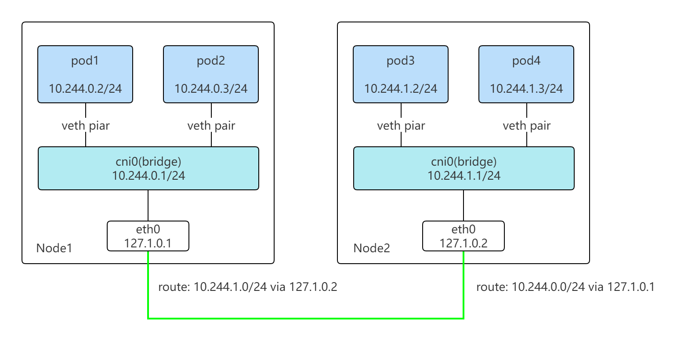

# MyCNI

A simple CNI plugin for kubernetes, similar with Flannel host-gw.

## Components
`mycni`: CNI plugin for containers, create Linux Bridge, veth pair and assign IP for Pod.
`mycnid`: daemon service on each host, watch Nodes and set routes, iptables for each host.

Network architecture:

## Build
`make`

## Deploy
`make deploy` or `kubectl apply -f deploy/mycni.yaml`
